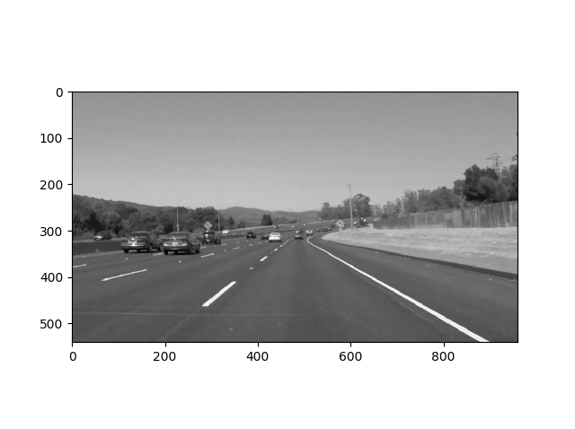
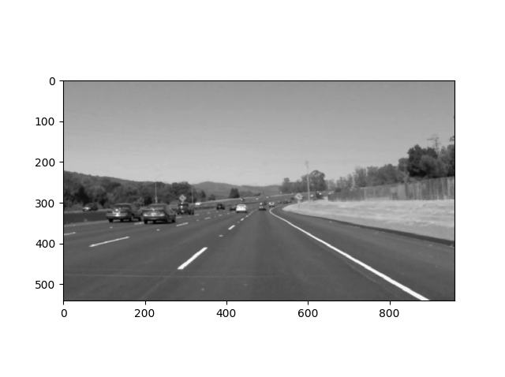
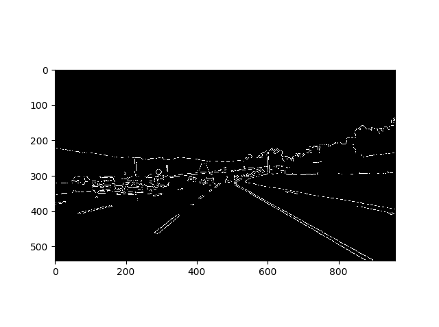
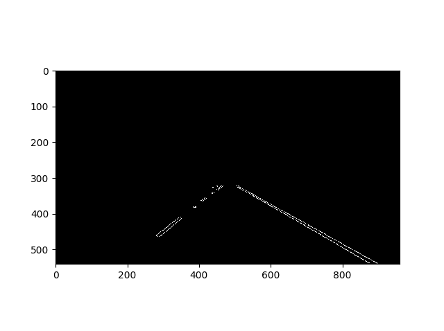
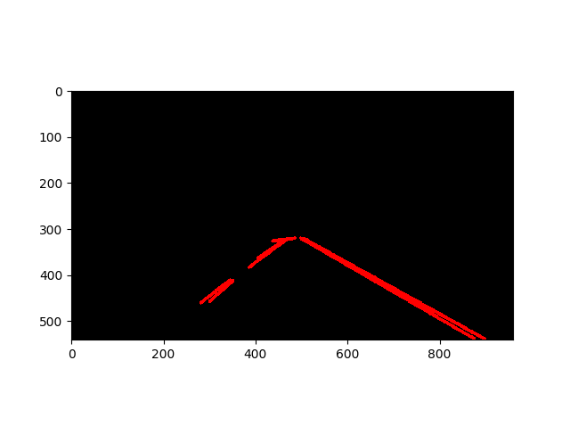
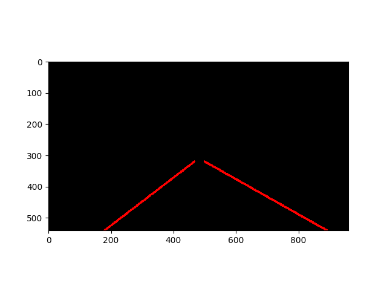
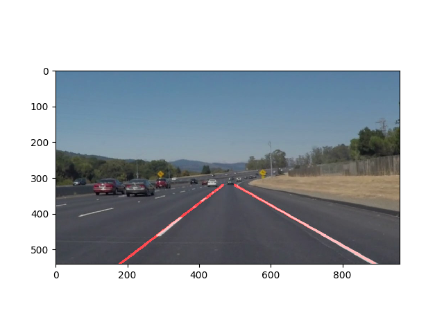

#**Finding Lane Lines on the Road**

##Project Description

###This is a project write up for finding lanes on the road as a part of Udacity Self Driving course.

---

**Finding Lane Lines on the Road**

The goals / steps of this project are the following:
* Make a pipeline that finds lane lines on the road
* Reflect on the approach

[//]: # (Image References)

[image1]: ./examples/grayscale.jpg "Grayscale"

---

### Reflection

###1. Pipeline.

My pipeline consisted of following steps.

1. Convert to grayscale
2. Apply Gaussian filter
3. Edge Detection
4. Region of Interest
5. Hough Transform
7. Lane Lines
8. Overlay lanes lines
9. Save File

**Convert to grayscale**

Image is converted to gray, this is needed for edge detection.

**Apply Gaussian filter**

This blurs the image and removes all the rough edges in the images, there by getting rid of noisy edges.

**Edge Detection**

The various edges are detected using OpenCV's canny function.

**Region of Interest**

A four sided polygon is selected, that effectively covers the whole lane view in front of the car. This reduces the area of the image that needs to be processed.

**Hough Transform**

Hough Transform detects the various lines in the image.

**Lane Lines**

The following actions are performed here

* From a list of lines (returned by Hough Transform), based on its slope, we seperate it into groups of lines for left lane and right lane. Lines are also rejected that are too vertical or too horizontal.
* For each left and right lane lines
  * A Linear Regression is performed to find slope and intercept of the points.
  * A single line is fitted against the linear equation
  * While processing Video frames, the slope and intercept are running-averaged over last 20 frame's slope and intercept. This gives smoother slope/lines.
  

**Overlay lanes lines**

The lane lines are overlayed on top of the original image.

**Save Image**

The lane-marked image is saved to disc.

If you'd like to include images to show how the pipeline works, here is how to include an image:

###2. Identify potential shortcomings with your current pipeline

* The lines are not smooth for curved lanes.
* The video processing needs to be tuned more and made smoother.
* Not sure, how it might perform in poor lighting and lighter lane markings.

Another shortcoming could be ...

###3. Suggest possible improvements to your pipeline

* The top coordinates for lane marking can be made more smoother by averaging past coordinates.
* Further tuning of Hough Transform parameters.
* Code optimization and refractoring.
